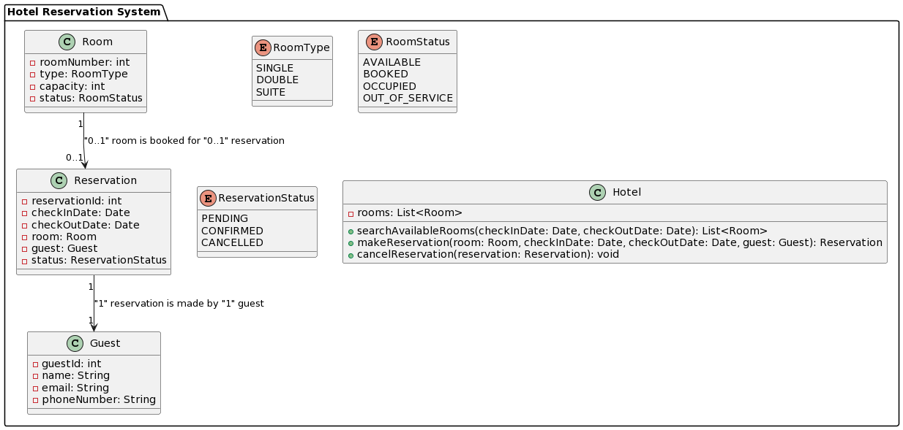

## Desafio DIO: Explorando padrões de projetos
Decidi criar um sistema de reservas de hotel para explorar padrões de projetos, foi usado os seguintes opadrões de prjetos:
1. **Strategy**:
para permitir diferentes algoritmos de cálculo de preço de reserva.
2. **Observer**:para notificar os clientes sobre a disponibilidade de quartos.
3. **Builder**: para construir diferentes tipos de pacotes de reserva.

## Regra de Negócio: Sistema de Reservas de Hotel

1. **Disponibilidade de Quartos**:
    - Um quarto só pode ser reservado se estiver disponível para as datas solicitadas pelo cliente.
    - O sistema deve verificar a disponibilidade do quarto no momento da reserva e evitar duplicatas.

2. **Política de Cancelamento**:
    - Os clientes podem cancelar suas reservas, mas a política de cancelamento pode variar.
    - Se um cliente cancelar a reserva dentro de um prazo específico (por exemplo, 24 horas antes do check-in), ele pode ser reembolsado integralmente.
    - Reservas canceladas após o prazo podem estar sujeitas a taxas de cancelamento.

3. **Restrições de Capacidade**:
    - Cada tipo de quarto tem uma capacidade máxima de ocupação (por exemplo, um quarto duplo pode acomodar no máximo duas pessoas).
    - O sistema não deve permitir que um cliente reserve um quarto que exceda sua capacidade máxima de ocupação.

4. **Check-in e Check-out**:
    - Os clientes devem fazer o check-in no hotel antes de ocupar o quarto.
    - O sistema deve registrar a hora do check-in e do check-out para controle de ocupação e cobrança de tarifas.

5. **Tarifas e Descontos**:
    - As tarifas dos quartos podem variar com base em fatores como temporada, tipo de quarto, pacotes especiais, etc.
    - O sistema deve calcular automaticamente o preço da reserva com base nos detalhes fornecidos pelo cliente.
    - Descontos podem ser oferecidos para estadias prolongadas, clientes frequentes, ou reservas antecipadas.

6. **Gerenciamento de Conflitos**:
    - Se ocorrer um conflito de reservas (por exemplo, dois clientes reservam o mesmo quarto para as mesmas datas), o sistema deve resolver o conflito de forma justa e transparente.
    - O sistema pode oferecer opções alternativas de acomodação ou compensações, se necessário.

7. **Notificações e Confirmações**:
    - O sistema deve enviar notificações de confirmação para os clientes assim que uma reserva for concluída com sucesso.
    - Os clientes também devem receber lembretes automáticos antes da data de check-in e detalhes da reserva.

## UML do projeto

